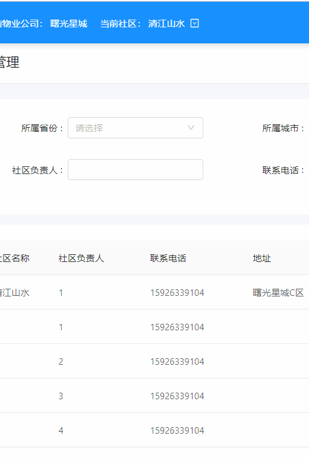

## ngx-dropdown-table

Angular 中一种通用业务组件，下拉 table 菜单，支持搜索、翻页

使用场景：后台管理系统中当需要切换当前某个主体时可以使用



### 基本使用

```
npm i ngx-dropdown-table

// 注册组件
import { DropdownTableComponent } from 'ngx-dropdown-table';
@NgModule({
  declarations: [
    DropdownTableComponent
  ],
  exports: [
    DropdownTableComponent
  ],
})
// 使用组件

当前社区： <app-dropdown-table [config]="config"></app-dropdown-table>

config = {
  api:...,
  renderTitle:row=>row.title
  renderItem:row=>row.name
  title:'社区列表',
  placeholder:'请输入社区名称'
}

```

### API

- 输入属性
  config: IConfig 配置对象

```
import { Observable } from 'rxjs';
interface IBody {
  pageSize: number;
  pageNo: number;
  [key: string]: any;
}
type IParams = IBody;

export interface IRow {
  id: number;
  name: string;
  [key: string]: any;
}

export interface IPageResult<T> {
  total: number;
  totalPage: number;
  pageSize: number;
  pageNo: number;
  rows: Array<T>;
}

export interface IResult {
  code: string;
  data: IPageResult<IRow>;
  [key: string]: any;
}

export interface IConfig {
  api: (obj: IBody | IParams) => Observable<IResult>;
  [key: string]: any;
}


```

- 不论是父子组件还是非父子组件，都可订阅 settings.notify 事件获取每一行被点击的通知

```
this.settings.notify.subscribe(item=>console.log(item))
```

- 该组件还可响应外部组件要求更新列表的事件，任意地方调用 this.settings.setApp({event:'LIST-CHANGED'}) 即可触发 dropdown-table 组件更新列表
